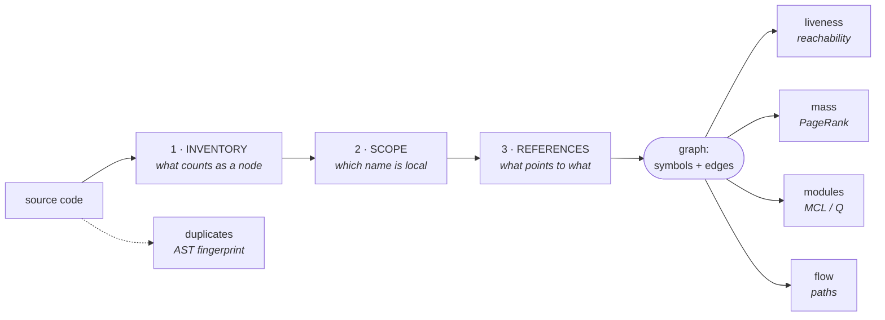

# mcview

**Structural understanding of a codebase, computed in seconds, for whoever has to change it
without having read it.**

Copy one directory, write one `.toml`. No build, no package, no dependencies on the main
path.

```bash
mcview/mcview.py --orient "Retrieval" --flow    # what is this area, how do you get in,
                                                # where does it go, what does it cross first
```

---

## The problem it was built for

An agent —or a person on their first day— is asked to change something. What it needs before
writing a line is not the file: it is the *shape*. Who calls this. What already crosses it.
Whether something like it already exists. Where it stops being traceable.

Today that comes from two places and both fail:

- **Documentation rots.** It describes the system as it was when somebody wrote it down.
- **Reading the code doesn't scale.** Five files to answer one question, and the answer is
  only as good as which five you happened to pick.

mcview computes it from **today's AST**, so it cannot be out of date by construction. It
answers in seconds what would otherwise cost an afternoon of reading, and every number comes
with what it does *not* claim attached.

### And the second half: connections

A component is protected by a test — you call it and look at what it returns. **A connection
is not.** "Every request crosses the tenant resolver before touching the database" is not a
call: it is a property of *every path*, and there is no way to write it as an assertion about
a function.

That is why repositories tend to have their components secured and their connections not.
mcview makes a connection contract verifiable with one primitive:

> Remove the nodes that guarantee the connection and ask whether the sink is still reachable.
> If it is, **that path is the bypass** — and it is its own evidence.

```bash
mcview/mcview.py --propose "api/routers/" "store/client.py"   # where a lock is worth putting
mcview/mcview.py --locks                                      # run the declared contracts
```

---

## What it answers

| question | command |
|---|---|
| **What is this area and how does it work?** | `--orient <target> --flow` |
| **What happens, and in what order?** | `--sequence <target> --to <destination>` |
| **How is the system distributed?** | `--atlas` (interactive 2D map) |
| **What can a message traverse, across repos?** | `--route "<name>"` |
| **Does this connection still hold?** | `--locks` · `--propose` |
| What code is unused? | census (`mcview.py`) |
| What is duplicated? | census · `--exists <file>` |
| Where does the system go? | `--map` (PageRank) |
| Is this well modularized? | `--k` · `--hierarchy` · `--islands` |
| What did this change do to the repo? | `--diff <ref>` |
| What actually runs? | `--runtime` (probe census) |
| What do I have to restart? | `--services` |
| How do my repositories join? | `--seams` · `--bridges` |

All of them accept `--json`, which is the point: the output is meant to be handed to an agent
instead of sending it off to explore.

---

## Two things it does that a code index does not

**It measures with a random walk, not with a count.** A walker starts at the *declared entry
points* and follows references; where it spends its time is the usage mass (personalized
PageRank), and where it gets trapped are the modules (Markov clustering). Same chain, two
questions. A helper called once from the heart of the system weighs more than one called
twenty times from a cold corner — a flat count says the opposite.

**It parses the AST instead of using an index.** An index can have *silent holes*: calls that
show up neither as resolved nor as unresolved. A silent hole is worse than an unresolved
reference — the unresolved one is visible and can be rescued; the missing one is
indistinguishable from "unused". Measured against a real index over the same code: **112,476
of our own edges against 9,770 of theirs (11.5×)**.

---

## Quickstart

Two ways in, and the first one is the primary:

```bash
# A. copy the directory — no install, no build, works offline, and it is what the
#    skills and the portability lock document and verify
git clone https://github.com/mcalza96/mcview && cp -r mcview/ /path/to/your-project/

# B. install from git — nothing to clone, `mcview` lands on your PATH
uvx --from git+https://github.com/mcalza96/mcview mcview --map
pipx install git+https://github.com/mcalza96/mcview
```

Both models coexist because the entrypoint does the same thing either way: `mcview.py` puts
its own directory on `sys.path` and lets `_layers` mount the rest, so the flat imports resolve
whether the directory was copied or installed. **Python 3.11+, zero dependencies on the main
path.** It is not on PyPI: the name is taken there by an unrelated project.

The rest of this README, and every command block in the four skills, is written for **A** —
`mcview/mcview.py …`. With **B**, drop the path and use `mcview …`.

```bash
# 1. copy the directory into your project
cp -r mcview/ /path/to/your-project/

# 2. write one mcview.toml at the root (the roots are the only mandatory part)
cd /path/to/your-project
cat > mcview.toml <<'TOML'
[project]
name = "my-api"
root = "src"

[roots]
decorators    = ["task", "command"]     # @task(...) registers into a dict → it is a root
route_methods = ["get", "post"]         # @router.get(...) / @app.post(...)
route_objects = ["router", "app"]
dirs          = ["src/cli/", "tests/"]  # every module in here is a root
product_dirs  = ["src/cli/"]            # of those, which ones are NOT tests
TOML

# 3. run it
mcview/mcview.py                    # the census
mcview/mcview.py --map              # where the system goes
mcview/mcview.py --orient <area>    # the brief for one area
```

**Declaring the roots is half the work.** Without them, reachability declares the entire
project dead. And they are not invented — the project already declares them somewhere:
`[project.scripts]`, the `Dockerfile` `CMD`, the framework decorators that register into a
dispatch dict. See [`skills/mcview-install`](skills/mcview-install/SKILL.md) for where to look
and how to check the yardstick is not broken before believing a number.

Supports **Python** (stdlib `ast`) and **TypeScript/TSX** (`tree_sitter`, optional).
Requires Python **3.11+** — that is where `tomllib` became stdlib, which is what keeps the
main path at zero dependencies.

---

## The design decisions, and what each one bought

### The core has no dependencies

| what | needs | if missing |
|---|---|---|
| census, duplicates, `--map`, `--risk`, `--diff`, `--exists`, the gate | **nothing** — stdlib | — |
| **`--orient`, `--flow`, `--sequence`, `--atlas`, `--mermaid`, `--html`** | **nothing** — stdlib | — |
| `--modules`, `--k`, `--hierarchy`, `--islands`, `--views` | `numpy`, `scipy` | it says what to install and exits |
| any TypeScript project | `tree_sitter`, `tree_sitter_typescript` | it says what to install and exits |

That the main path runs on the bare stdlib is **verified by blocking the modules**, not by
reading the imports. It is what makes installing the tool a matter of copying a directory.

### The config does not live inside the tool

While `mcview.toml` sat inside `mcview/`, extracting the module into another repository
carried the previous project's configuration with it: the promise that "everything specific
lives in a `.toml`" was true on paper and false in the file tree. The config is now
**discovered** by walking up from the current directory.

### Layers are directories, not packages

```
your-project/
  mcview.toml         ← the only thing you write
  mcview/
    mcview.py         ← the CLI
    gate.py           ← the pre-write hook
    extraction/       ← the ONLY layer that looks at code: config, factory, python, typescript
    graph/            ← reachability, paths, contracts, Markov, the cached index, the weave
    views/            ← one question each; none of them looks at the code again
    render/           ← text, mermaid, canvas, page
    selfcheck/        ← the locks that protect the tool itself
    skills/           ← the manual for the agent, travels inside
    vendor/           ← the diagram renderer, travels inside
  src/…
```

They are mounted on `sys.path` (`_layers.py`), so imports stay flat and splitting the tree did
not touch a single one of the 35. The price, stated up front: two layers cannot hold a file
with the same name — `_layers.collisions()` verifies that rather than trusting it. A real
package would force `python -m mcview` and break the "copy the directory and go" promise.

### The skills travel inside

```bash
ln -s ../../mcview/skills/orient-session .claude/skills/orient-session
ln -s ../../mcview/skills/mcview-repo    .claude/skills/mcview-repo
```

[`orient-session`](skills/orient-session/SKILL.md) is the reading manual: what each number
means and what it does NOT assert. [`mcview-repo`](skills/mcview-repo/SKILL.md) is the
measuring and cleaning manual. [`mcview-process`](skills/mcview-process/SKILL.md) is for
understanding a process end to end. [`mcview-install`](skills/mcview-install/SKILL.md) is for
setting it up in a new repository.

Leaving them outside would be extracting the engine and abandoning the manual — which is the
half that keeps somebody from reading a ranking as a conclusion.

---

## How it works: three steps, and after that everything is a view

Each view answers a different question, but **none of them looks at the code again**: they all
read the same three structures. That is why a defect in one step shows up in every view at
once, and why fixes go to the step, not to the view.



| step | decides | if it gets it wrong |
|---|---|---|
| **inventory** | what counts as a symbol | nodes that are not code units absorb mass |
| **scope** | whether a read is local or a reference | fabricated edges, and paths that do not exist |
| **references** | who points to whom | everything above |

---

## What it returns: grades of evidence, not a boolean

**"Alive" is not yes/no.** Collapsing it to a boolean overestimated liveness by a factor of
eight in the first project measured.

| status | means |
|---|---|
| `ALIVE_PROVEN` | it ran at runtime — never touch |
| `ALIVE_PRODUCT` | reachable from a real root, by an unambiguous name |
| `ALIVE_PRODUCT_WEAK` | reachable **only** via an ambiguous name (homonyms) |
| `TEST_ONLY` | alive purely because a test or a script touches it |
| `ALIVE_BY_NESTING` | alive only by being nested inside something alive |
| `DEAD_CANDIDATE` | no references at all |

`ALIVE_PRODUCT_WEAK` and `TEST_ONLY` are where the entropy lives: code nobody deletes because
the graph says it is used, when what holds it up is a homonym or its own test.

### Safety contract

**`DEAD_CANDIDATE` is not a deletion order.** It is a hypothesis with no static evidence of
use. Confirming it requires runtime or manual verification. The guarantee lives in what the
tool returns, not in the prompt of whoever invokes it.

The whole chain is **fail-open**: when in doubt, alive. False "dead" is the failure mode that
hurts; false "alive" only costs a review.

---

## Locking a connection

Three contracts, one idea. Remove what guarantees the connection and ask whether the sink is
still reachable.

| contract | what it demands |
|---|---|
| `crosses G` | interposition: the data always goes through G |
| `requires G` | precondition: someone on the path called G first |
| `cannot_reach` | isolation: no path exists |

```toml
[[locks]]
name     = "every route resolves the tenant before touching the database"
src      = "api/routers/"
dst      = "store/client.py"
requires = "get_tenant_id"
```

**`requires` is not `crosses` under another name.** A guard is not *on* the path: it is called
BEFORE, as a precondition with an early return, so in the graph it is a **sibling**. Treating
it as an interposition —which is what a dominator does— produced **64 false bypasses** on a
frontend whose routes were in fact protected.

The verdict is exact, not sampled: it is proven by removal, and the finding *is* the bypass
path, so it can be verified by reading three functions.

**Reading an empty result.** `--propose` can return zero candidates, and that is not "I found
nothing": it is "I found that nothing is interposed". Protection is not missing — the
chokepoint to put it on is missing, and building one is a design decision, not a cleanup.

---

## The pre-write gate

Detecting means cleaning up afterwards; the gate is about it not happening. As a `PreToolUse`
hook on `Write|Edit`, it queries the index before the code reaches disk and warns if that
already exists. It costs ~60 ms.

**It never blocks and it fails open** — any error or missing index lets the write through. A
hygiene tool cannot stop the work.

```bash
mcview/mcview.py --reindex             # build the cache
mcview/mcview.py --exists file.py      # does this already exist?
```

The default threshold (0.75, overridable with `MCVIEW_GATE_THRESHOLD`) **loses recall on
purpose**: at 0.55 it would catch more real duplication but would fire on 58% of writes, and a
gate that always shouts becomes invisible within a week.

---

## Crossing the repository boundary

**The seam between projects is made of STRINGS, not symbols.** A gateway does not import a
function from the backend: it hits a route and asks for a tool by name. No call graph crosses
that, and no tool that looks at a single repo sees it.

```bash
mcview/mcview.py --seams          # this project's literals
mcview/mcview.py --bridges        # joins every mcview*.toml in the workspace
mcview/mcview.py --atlas --workshop
mcview/mcview.py --route "<name>" # from A to B, across repositories
```

Two relations that are **not the same**, and confusing them is the expensive mistake:

- **call** — one project writes the other's identifier. Listed with the exact line on both
  sides.
- **shared state** — two projects touch the same table **without ever calling each other**. It
  appears in no call graph, and it is usually where the authorization surface lives.

Routes are the hard case: a route is assembled across three files (`APIRouter(prefix=…)` + the
`include_router` of whoever mounts it + the decorator's literal). `route_prefixes` follows that
chain through the imports and reconstructs **158 of 158**, verified against routes known in
advance.

---

## The runtime census

Where code is resolved BY NAME —plugins, platforms, dispatch tables, an agent's tools— **no
static analysis reaches**, and there a low number does not mean "unused" but "I cannot see it".

The probe does not live here: it belongs to the measured project, and mcview only READS the
JSONL it leaves in `<root>/.mcview/`. It uses `sys.monitoring` (PEP 669, py3.12+) and the
callback returns `DISABLE`, which turns monitoring off *for that code object* after the first
hit — each function costs once and zero thereafter. **It is not a profiler, it is a census**,
and it can be left on in a real process. Measured overhead over 3M calls: indistinguishable
from noise.

**The direction is non-negotiable: it only PROMOTES to alive, never demotes to dead.**
Something not showing up may simply mean it did not run inside the observed window.

It is not a nicety. A gateway's agent loop measured **0.05% of static mass** — under any
automatic criterion it would have been the first thing deleted. The runtime census showed
**50% of its symbols ran**; the static graph simply could not see it.

---

## The locks that protect the tool itself

```bash
mcview/selfcheck/check_portability.py   # copied to a clean dir, does it still work?
mcview/selfcheck/check_reach.py         # does the graph respect lexical scope?
mcview/selfcheck/check_contracts.py     # is the contract primitive right on known graphs?
mcview/selfcheck/check_blocks.py        # do duplicates still see nested blocks?
mcview/selfcheck/check_view.py          # do the views still SAY something?
mcview/selfcheck/check_config_keys.py   # does every .toml key have a reader?
```

The last one exists because of the worst failure mode this tool can have — **the one that does
not crash**. When a config key and the code that reads it drift apart, nothing raises: the
reader gets its default, the view runs, and it returns an empty list. And an empty list from a
detector reads exactly like "there is nothing here", which is a finding.

`check_portability` exists for the same reason in the other direction: **encapsulation erodes
silently**. Nobody notices until they try to extract the tool. It copies `mcview/` into a
temporary directory with a synthetic project and runs the CLI **as a subprocess** — importing
the modules would prove nothing, because `sys.path` and `cwd` are already contaminated.

---

## Known limits

- **It is structure, not execution.** A path in the graph may never be walked; an absent one
  may exist anyway (dynamic dispatch, plugins by name). The bias is toward the false negative:
  it never invents a path.
- **Mass does not predict execution.** Measured against a probe: AUC **0.506** — 0.50 is
  predicting nothing. It orders by *structural centrality*, which is exactly what it says and
  nothing more.
- **The optimal partition `--k` returns is not identifiable**: there are exponentially many
  with almost equal Q. Q as a scalar compares well; "these are the N modules" does not hold.
- **It does not see argument filtering.** It finds "reaches the sink without crossing the
  guard", not "crossed the guard but forgot the tenant filter".
- **Nested blocks are Python only.** In TypeScript the report says `0 blocks`, which is correct
  but easy to misread: it does not mean there is no duplication inside functions, it means it
  is not looked for there.
- **None of these metrics has external validation** against bugs or maintainability.
- **Cost:** ~7 s over 5,500 symbols; ~2 min over 42,000. A real-time gate would need
  incremental analysis, which is not there today.

---

## The numbers in this README

There are two classes, and only one can drift:

- **Dated anecdotes** — "64 false bypasses", "112,476 against 9,770", "AUC 0.506". They
  happened. They do not change with a commit, and they are what makes the lesson credible.
  They get quoted.
- **Current state of a repo** — how many symbols there are, what percentage is `TEST_ONLY`.
  Those change with every merge. They are not quoted from memory: they are recomputed.

It is the same rule that makes the tool exist, applied to its own manual. And it is not
theoretical: this README once cited "1300 symbols" when the repo already had 5,790.

---

## License

MIT. The vendored diagram renderer (`vendor/mermaid.min.js.gz`, mermaid 11) is MIT as well.
