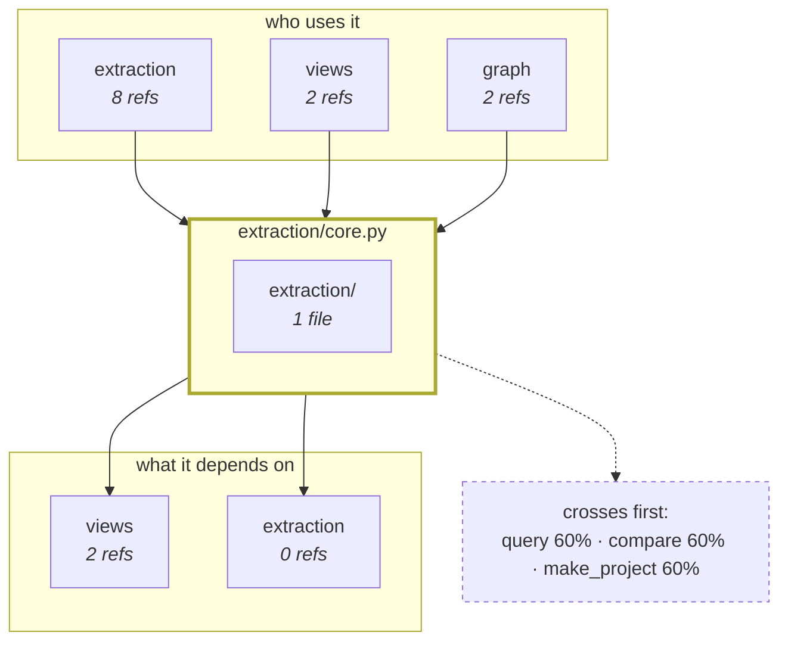

# mcview

You have to change code you have not read. Documentation describes the system as it was when
somebody wrote it down, and reading your way in does not scale — five files to answer one
question, and the answer is only as good as which five you happened to open.

mcview computes the answer instead. From today's AST, in seconds, so it cannot be stale.

```
ORIENTATION — Persistence   (module)
2 files · 16 symbols · 5.38% of the project's mass

cohesion 0.61
(complete graph; --hierarchy measures it without hubs — not interchangeable)

── TEMPERATURE ────────────────────────────────────────────
  ALIVE_PRODUCT            12
  ALIVE_PRODUCT_WEAK        2
  ALIVE_NOT_PRODUCT         1
  DEAD_CANDIDATE            1
  cold (mass ~0)            2   referenced, but the system does not go through them
```

One directory, one `.toml`, no dependencies on the main path. Python and TypeScript. Usable as a
CLI or as an MCP server.

### What it is for, and what it is not

It exists to **orient whoever is about to work** — increasingly, an agent that does not hold the
repository in its head. It says what is there so you build and audit with more discipline and
less flailing, and faster than by opening twenty files to find the three that matter.

That is the whole purpose. Everything it deliberately does *not* do follows from it:

- **It is not a health check.** It has no opinion about quality. It reports mass, reachability,
  duplication and cohesion; whether any of that is a *problem* depends on what the project is
  for, and it does not know that.
- **It does not decide, and it never authorises a change.** `DEAD_CANDIDATE` is a hypothesis,
  not a deletion order. A duplicate is a shape, not debt.
- **It does not replace reading the code.** It tells you *which* code to read — every view ends
  pointing at a concrete path, precisely so you go and verify it.

The decisions stay with the person. What this moves is the **cost of being disciplined**: what
used to mean holding the repo in your head, or trusting documentation that drifted, becomes a
measurement you can take in one command and cite.

---

## How it works

Three steps produce a graph — inventory, scope, references — and **every view reads that graph
without looking at the code again**. A defect in one step therefore shows up in every view at
once, which is why fixes go to the step and never to the view.


A random walker starts at the **declared entry points** and follows references. Where it spends
its time is the usage mass (personalized PageRank); where it gets trapped are the modules (Markov
clustering); how often a route crosses a node is an absorbing chain. Same matrix, three
questions.

The personalization is what makes it correct. Classic PageRank teleports to any node — it models
someone who can start browsing on any page. A program cannot: it always starts at an entry point.
Seeding the jump at the roots is what turns generic centrality into "how much this is used when
the system runs".

That also explains the one thing you have to configure. Without declared roots there is nowhere
to seed, and reachability declares the whole project dead.

[`docs/THEORY.md`](docs/THEORY.md) has the formulas, the parameters that were measured rather
than chosen, and where each one runs.

### Two decisions that shape everything downstream

**Paths run on unambiguous edges only.** A path is a stronger claim than a reference and needs
stronger evidence. On the reference project the complete graph has 124,531 edges against 8,058
unambiguous ones, and with the former everything reaches everything: a first attempt reported 351
of 402 roots "reaching" one subsystem, listing `client` and `get` from test files as what the flow
crosses. That is not a flow — it is noise shaped like one, which is worse than showing nothing.

**The AST, not a code index.** An index can have *silent holes*: calls that appear neither as
resolved nor as unresolved. A silent hole is worse than an unresolved reference — the unresolved
one is visible and can be rescued, the missing one is indistinguishable from "unused". Measured
against a real index over the same code: 112,476 edges against 9,770.

### Why every number carries a caveat

Because the measurements kept contradicting the readings. Mass looked like importance until it
was checked against a runtime probe and came out at AUC 0.506 — chance. A guard-detector looked
correct until it produced 64 false bypasses on routes that were in fact protected. A subsystem
measured 0.05% of mass and 50% of it had just run.

So every number ships with what it does *not* claim — printed on the CLI, and as a `caveat` field
on every MCP result. It is the most important content in this file, and it is [collected in one
table below](#what-each-number-does-not-claim).

---

## What it answers

| question | command | MCP tool |
|---|---|---|
| What is this area and how does it work? | `--orient <target> --flow` | `mcview_orient` |
| What happens, and in what order? | `--sequence <target> --to <dest>` | `mcview_process` |
| Which edges CAN the flow traverse? | `--sequence <target> --all` | — |
| Draw how this works, for someone who will not read the code | `--blueprint` | `mcview_blueprint` |
| The JOURNEY as a figure, from a spec you write | `--walkthrough <spec.toml>` | — |
| What can a request traverse, across repos? | `--route "<name>"` | `mcview_route` |
| Does this already exist? | `--exists <file>` | `mcview_exists` |
| Where does the system go? | `--map` | `mcview_map` |
| What code is unused? | `--status DEAD_CANDIDATE` | `mcview_status` |
| Does this connection still hold? | `--locks` · `--propose <a> <b>` | `mcview_locks` |
| How do my repositories join? | `--seams` · `--bridges` | `mcview_seams` |
| What did this change do to the repo? | `--diff <ref>` | `mcview_diff` |
| What do I have to restart? | `--services` | — |
| Is this well modularized? | `--k` · `--hierarchy` · `--islands` | — |
| What actually runs? | `--runtime` | — |

Everything accepts `--json`.

---

## A complement, not a replacement

mcview is **not a code retrieval engine, and it should not be your only one.** If you need to
find a symbol, read its source, or follow a call chain across 30 languages in milliseconds,
use an indexer built for that — [codegraph](https://github.com/colbymchenry/codegraph) is the
one this was measured against, and any similar pre-indexed graph serves the same role. They
persist to SQLite, watch the file system, and answer retrieval questions faster than anything
here will.

The two answer different questions, and the split is clean:

| | a code index | mcview |
|---|---|---|
| question | *show me the code, and who calls it* | *what shape is this, and what is rotting* |
| unit | the symbol | the judgment over the whole |
| gives you | verbatim source, call paths, blast radius | liveness with grades of evidence, structural duplication, usage mass, modularity, seams between repos, a pre-write gate |
| freshness | persistent index + watcher | recomputed from today's AST |

Run both. Ask the index *where things are*; ask mcview *whether the shape holds*.

### Why the pairing, and what would end it

**This is a scope decision, not a dependency.** mcview has none, runs alone, and the one
self-check that reads an index skips loudly when there is not one. Nothing here degrades if you
never install another tool.

What it does not do is retrieval, and that is on purpose. Answering *"show me this symbol's
source"* well means a persistent index, a file watcher and a parser per language — three things
whose cost is paid once by whoever specialises in them, and paid forever by anyone who bolts
them onto something else. Today that half is better bought than built, so the honest advice is
to run an index alongside and ask each for what it measures.

The half that is genuinely mine is the judgment: liveness with grades of evidence, structural
duplication, usage mass, the seams between repositories, the pre-write gate. That is where the
work goes.

**What would change the calculus.** If the extraction layer has to grow — more languages, or a
persistent graph so a large repository does not pay the parse on every call — that is a core of
its own and it will be written. It is not written yet because the measurement does not ask for
it: building the graph costs ~3 s cold on a 6k-symbol repository and every view over it runs
in milliseconds — and the one place that cost was actually paid per call, the MCP server's
edit-ask loop, is covered by an in-process per-file facts cache (a warm rebuild after editing
one file is ~80 ms, measured 37×). That cache dies with the process and keeps zero state on
disk, which is the line this project does not cross. And the blocker for more languages is not the
parser: it is that each framework declares its entry points differently, and a parser without
those conventions produces a config that runs, reports numbers, and measures nothing.

So: paired today, on evidence. Not paired on principle, and not paired forever.

**Measured on the same 6.2k-symbol repository, and this is why they are not interchangeable.**
Their inventories agree to within 0.3% — 6,168 symbols vs 6,186 — which is strong mutual
validation of both extractors. Their reference graphs do not: 62% of symbols have no incoming
edge in the index, against 1% that mcview reports as dead candidates. Feeding one tool's edges
to the other would turn 70 deletion hypotheses into 3,810. Neither number is wrong for its own
purpose — an index that drops an ambiguous reference is being conservative about *retrieval*,
where a wrong edge sends you to the wrong file; mcview cannot drop it, because a missing edge
is exactly how live code gets reported dead.

So: use both, and do not cross the wires.

---

## Install

```bash
# as a command
pipx install git+https://github.com/mcalza96/mcview
pipx inject mcview tree_sitter tree_sitter_typescript   # only for TypeScript projects

# or copy the directory — no install, works offline
git clone https://github.com/mcalza96/mcview && cp -r mcview/ /path/to/your-project/
```

Requires Python **3.11+**. The main path has zero dependencies; `numpy`/`scipy` are needed only
by `--modules`, `--k`, `--hierarchy`, `--islands` and `--views`, and `tree_sitter` only by
TypeScript projects. Each says what to install and exits.

Copying the directory is the model the four bundled skills and the portability check document
and verify; the packaged command exists so you do not have to clone. Both work — the entrypoint
puts its own directory on `sys.path` either way.

### As an MCP server

```bash
claude mcp add --scope user mcview -- mcview --mcp
```

Ten tools, listed above. When the server is global, pass `projectPath`: one process serves many
repositories, and without it the answer depends on the directory the client launched it from.

Not on PyPI — the name is taken there by an unrelated project.

---

## First run

```bash
cd your-project
mcview --init      # derives mcview.toml from what the project already declares
mcview             # the census
mcview --map       # where the system goes
```

**Declaring the roots is half the work, and it is the only mandatory part.** `--init` will not
decide which entry points matter — that is a statement about the project, not about the file
system — but it stops you writing them from memory. It reads `[project.scripts]`, the Dockerfile
`CMD`, the decorators that register into a dispatch dict and the process entrypoints, and writes
each root with its provenance:

```toml
[roots]
#   mcp_tool: 168 uses in 28 files (e.g. api/v1/mcp_tools/ast_tools.py)
decorators = ["mcp_tool"]
#   candidate — `mcp_prompt`: 4 uses but only in 1 file. One file is not enough
#   to declare a registry; look at it.
route_methods = ["post", "get", "delete", "patch", "put"]
route_objects = ["router", "app"]
dirs = ["entrypoints/worker.py", "entrypoints/main.py", "tests/"]
product_dirs = ["entrypoints/worker.py", "entrypoints/main.py"]
```

Checked against a config a human had written by hand for a 740-file backend, `--init` derived the
two large root classes exactly (169 tools, 171 routes) and the same 6,186 symbols. What it could
not decide it flagged as candidates, and the whole census difference was those flagged roots.

If it finds no registration decorators, no routes and no entrypoint, it says so and falls back to
whole directories — which is the expensive mistake. On one 448-file project, declaring directories
gave 649 roots and the flow stopped discriminating: when everything is an entrance, "how do you
get in" has no answer.

### Before believing a number

1. **Root count against file count.** If they are close, you declared directories.
2. **Is `DEAD_CANDIDATE` plausible?** Hundreds in a healthy repo means missing roots — usually a
   registration decorator. Zero in an old repo means too many.
3. **Does the map look like your system?** If something marginal tops it, ask what an *edge*
   means in this codebase before reading the mass.
4. **Ask it something whose answer you already know.**

### The doors, and why they are worth declaring

`[roots]` says what STARTS. `[surfaces]` says where a **user comes in** — the Telegram handler,
the HTTP route, the CLI's `main`. They are not the same statement and the second is the one no
measurement can make: which files are "the web app" against "the Telegram webhook" is a fact
about the product.

It is worth the two minutes, and the number says why. A file listed in `dirs` makes **every**
symbol in it a root, which is right for a directory loaded by name and wrong for an entry point:
measured on a gateway, eight entry files contributed **1,234 roots** where the project's own
`[project.scripts]` declares eight `main`s. With everything an entrance there is no "how do you
get in", and the heat map ends up measuring the files you declared instead of where a message
arrives — its top three WERE the declared files, and became the three platform adapters once the
doors were exact.

```toml
[surfaces]
telegram = ["_handle_text_message", "_handle_command"]
cli      = ["cli.py:main"]              # `file:symbol` when the name is not unique
```

A surface seeds roots, resolves as a target (`--orient telegram`), and anchors a flow. Without
one, a walk that starts from a module begins at its heaviest symbol — an inference, and measured
once, that inference landed on the OUTPUT formatter. The views say so when it happens, and hand
you the candidate list so you can ask instead of guess.

`mcview --init` proposes the candidates commented out. Naming and grouping them is yours.

---

## Reading the output

### Two shapes, both of them text

Everything below is mcview measuring **itself**, which is also how the layer inversion three
paragraphs down got found.

`--map` gives the usage mass, which answers *where does the system actually go*:

```
  HEAT MAP — mcview
  expected usage mass, derived from structure (without executing anything)

  2 files concentrate 50% of usage · 5 hold 80%   (of 38)

  49.71% ██████████████████████████████████████████ mcp_server.py
  12.34% ██████████                                 views/seams.py
   9.33% ███████                                    mcview.py
   5.51% ████                                       gate.py
   4.47% ███                                        extraction/factory.py
   3.59% ███                                        extraction/core.py
   0.43% █                                          views/heatmap.py
   0.17% █                                          views/atlas.py
```

Read it against the caveat, not around it: this is structural centrality, and it is *measured*
not to predict execution (AUC 0.506). `mcp_server.py` holding half the mass says every tool
call goes through one dispatch, not that it is the most important file.

`--orient <target> --flow --mermaid map` gives the neighbourhood — who reaches a target, what
it reaches, and what every path crosses first:



**That diagram is the reason it is worth drawing.** An earlier run of it put `render` in the
"depends on" box — the analysis core depending on the presentation layer, which cannot be
true. It was a fabricated edge: `_mark_branches` has five dict comprehensions over `x`, the
scope rule asked "is `x` read outside THIS comprehension?" once per comprehension, and the
reads inside comprehension #2 count as outside comprehension #1. So none of them bound it,
and every `x` resolved to a one-letter function in `render/journey.py` carrying the strongest
evidence the tool can give. The rule now asks the question about ALL the binders of a name at
once. A diagram is worth having when it makes a wrong answer look wrong.

And when the question is a JOURNEY rather than a map, `--walkthrough <spec.toml>` draws it: lanes
per process, stages in order, and the cuts as **bands** rather than arrows. It does not infer the
journey — it receives it, because the useful unit is a STAGE and a stage is a grouping a person
makes. What the tool does is refuse to draw a stage whose target does not resolve, so no box on
the figure was invented. SVG always; PNG only if a converter is already on the machine.

There is a third view, `--atlas`, and it is deliberately **not** shown here. It is an
interactive 2D canvas, so putting it in this file would mean a screenshot — and the position
of this project is that its output is text on purpose, because an image cannot be diffed and
goes stale without saying so. Run `mcview --atlas` and open the file it writes.

### "Alive" is not a boolean

Collapsing it overestimated liveness by a factor of eight on the first project measured.

| status | means |
|---|---|
| `ALIVE_PROVEN` | ran at runtime |
| `ALIVE_PRODUCT` | reachable from a real root, unambiguous name |
| `ALIVE_PRODUCT_WEAK` | reachable **only** through an ambiguous name (homonyms) |
| `ALIVE_NOT_PRODUCT` | reachable, but never from a product root — a test, a script, or a `dirs` entry left out of `product_dirs` |
| `ALIVE_BY_NESTING` | alive only by being nested inside something alive |
| `DEAD_CANDIDATE` | no references at all |

`ALIVE_PRODUCT_WEAK` and `ALIVE_NOT_PRODUCT` are where entropy accumulates: code nobody deletes because
the graph says it is used, when what holds it up is a homonym or its own test.

### What each number does not claim

| number | what it does **not** say |
|---|---|
| **mass** | Not importance, not real frequency: structural centrality. Measured against a runtime probe it does **not** predict execution (AUC 0.506). Plumbing tops the map. |
| **`DEAD_CANDIDATE`** | Not a deletion order. A hypothesis with no *static* evidence of use. Names reached only through a string — a registry, `mock.patch`, config dispatch — are invisible to it. |
| **flow / paths** | Structure, not execution. A path here may never be walked; an absent one may exist through dynamic dispatch. The bias is toward the false negative: it never invents a path. |
| **sequence** | The *written* order. A call inside an `if` appears even if it never runs; a dynamically dispatched one does not appear even if it always runs. |
| **cohesion** | Below 0.15 does not mean "split it" — it means it is not a unit, it is crosscutting infrastructure. `--hierarchy` measures it without hubs and gives a different number. |
| **runtime** | Confirms, never rules out. "Not observed" may mean it sits behind an `if`, fell outside the window, or ran in a process with no probe. |
| **`--diff`** | Typed signals, never a single score. Only `net_symbols` is validated against history; change heat and concentration are not. |
| **duplicates** | Same shape is not the same responsibility. Ask what would happen if *one* copy diverged. |

The whole chain is fail-open: when in doubt, alive. False "dead" costs something; false "alive"
costs a review.

### The narrative, and the set it cuts out of

`--sequence` answers *what happens and in what order*. To stay readable it descends the heaviest
call at each level, so it is a **narrative with a cut**. `--all` answers the other question —
*which edges can this flow take at all* — and it is a **set**, not an order:

```
  REACHABLE FROM — Ingesta   (256 entry symbols)
  2003 symbols · 51516 edges · 32% of the project
  447 of them through UNAMBIGUOUS names (22%)

  the narrative (`--sequence` without `--all`) shows 11 of them — 0.5%

  line of work            symbols   unamb   share
  Ingesta                     256     256   61.0%
  tests/unit                  553       1   22.2%
  Recuperación                110      80    1.7%
```

Two things there are the point. **The cut is now a number**: the readable narrative covers 0.5%
of the reach, and a cut whose size is unknown reads as if it were everything. And the reach is
reported at **two grades of evidence**, the same contract the liveness census uses — the wide
closure follows any resolved name, the narrow one only names belonging to a single symbol. Look
at `tests/unit`: 553 symbols reachable, **1** of them unambiguously. That is not the suite being
called by the ingestion path, it is `get`, `run` and `main` landing on the nearest namesake.

This is not a ranking problem, which is why mass does not solve it: PageRank is what *does* the
pruning, and it is measured not to predict execution. The set comes from reachability and the
share from the absorbing chain — both already in the tool, neither needing numpy. What was
missing was an output.

---

## Locking a connection

A component is protected by a test — you call it and check what it returns. A connection is not:
*"every request crosses the tenant resolver before touching the database"* is a property of every
path, and there is no way to write it as an assertion about a function. Repositories tend to have
their components secured and their connections not.

One primitive: **remove what guarantees the connection and ask whether the sink is still
reachable. If it is, that path is the bypass** — and it is its own evidence, verifiable by reading
three functions.

```toml
[[locks]]
name     = "every route resolves the tenant before touching the database"
src      = "api/routers/"
dst      = "store/client.py"
requires = "get_tenant_id"
```

| contract | demands |
|---|---|
| `crosses G` | interposition — the data always goes through G |
| `requires G` | precondition — someone on the path called G first |
| `cannot_reach` | isolation — no path exists |

`requires` is not `crosses` renamed. A guard is not *on* the path: it is called before, as a
precondition with an early return, so in the graph it is a **sibling**. Treating it as an
interposition — what a dominator does — is what produced the 64 false bypasses mentioned earlier.

Verdicts are exact, not sampled. `--propose <a> <b>` ranks candidates by mass and emits the TOML
block; an empty result means nothing is interposed, so there is no chokepoint to put a guarantee
on — building one is design, not cleanup.

**Status, plainly: this is a capability, not yet a practice.** The primitive is verified against
13 graphs with known answers (`selfcheck/check_contracts.py`), and no project has declared a
contract yet — the half that gets used is `--propose`, and its finding so far has been *there is
no chokepoint here*. Read the section as "what this makes possible", not as "what teams do with
it".

---

## Crossing the repository boundary

**The seam between projects is made of strings, not symbols.** A gateway does not import a
function from the backend: it hits a route and asks for a tool by name. No call graph crosses
that, and no single-repo tool sees it.

Two relations that are not the same:

- **call** — one project writes the other's identifier. Listed with the exact line on both sides.
- **shared state** — two projects touch the same table without ever calling each other. It appears
  in no call graph, and it is usually where the authorization surface lives.

Routes are the hard case: a route is assembled across three files (`APIRouter(prefix=…)`, the
`include_router` that mounts it, and the decorator's literal). `route_prefixes` follows that chain
through the imports and reconstructed 158 of 158 on the reference project.

---

## The runtime census

Where code is resolved by name — plugins, platform adapters, dispatch tables, an agent's tools —
no static analysis reaches, and a low number there means "I cannot see it", not "unused". This is
the 0.05%-of-mass subsystem from earlier: half of it had run.

**The probe is not part of mcview.** It lives in the project being measured, because it has to run
inside that project's deployed process; mcview only reads the JSONL it leaves behind. A reference
implementation is in [`docs/liveness_probe.py`](docs/liveness_probe.py). It uses `sys.monitoring`
(PEP 669) and returns `DISABLE`, which turns monitoring off for that code object after the first
hit — each function costs once and nothing thereafter. It is a census, not a profiler, and can be
left on in a real process: measured overhead over 3M calls was indistinguishable from noise.

It only promotes to alive, never demotes to dead.

### What has to be true for it to record anything

Every one of these fails **silently and identically**: an empty census, which reads as "nothing
ran" when it means "nothing was measured".

| condition | if unmet |
|---|---|
| `MCVIEW_PROBE=1` | no-op. Off by default on purpose — turning on observability nobody asked for is the kind of change nobody can later explain. |
| **Python 3.12+** | `sys.monitoring` does not exist; the probe returns `False` and says nothing. |
| `MCVIEW_PROBE_DIR` writable | returns `False` on `OSError`. |
| Code under `MCVIEW_PROBE_ROOT` (default `/app`) | every file is filtered out as foreign. Wrong root in a container ⇒ zero rows. |
| `start()` runs **in the deployed process** | see the two traps below. |
| No other profiler holds `PROFILER_ID` | the tool id is taken and monitoring never starts. |

### What has to be true for mcview to read it

| condition | note |
|---|---|
| Files land in `<project root>/.mcview/` or `<project root>/.salud/` | point `MCVIEW_PROBE_DIR` there, or copy them in. (`.salud/` is read too, for probes predating the rename.) |
| Filename contains `liveness` | anything else in that directory is ignored. |
| The path resolves to a file in the project | the container path (`/app/api/x.py`) is trimmed by the longest suffix that is a known file — no declared prefix to age out. |
| Symbol matches file **+ name + line** (±3 tolerance) | by name alone, a project's 96 `main`s would all be confirmed by the one that ran. The tolerance exists because the probe stamps the code object's first line and the inventory stamps the `def` — with decorators those differ. |

### Two traps that produced an empty census, both measured

- **The probe was not in the baked image.** The variable was set, the service was up, the file was
  never written.
- **The container started the service in-process**, so the `main()` holding the call never ran.
  Wiring it at module import fixed it.

Both looked identical from outside: probe "on", census empty. **Before believing a census, check
that it MEASURED** — that the file exists and has lines — not that the variable is set. The probe
is wired inside a `try/except` so it cannot block startup, and that same choice is what makes it
fail quietly. Expose its `state()` somewhere: it is the cheap way to tell "measured nothing" from
"never measuring".

### Reading it

Something absent may have run outside the observed window, sat behind an `if`, or run in a process
with no probe. And it is **one window**: a module that only runs in a scheduled task shows zero
and is not dead. For fine-margin decisions, leave it running for days, not minutes.

If a `DEAD_CANDIDATE` shows up as executed, that is not a detail: the static analysis was wrong and
a root is undeclared. Fix the `.toml` before reading anything else in that run.

---

## The pre-write gate

Detecting duplication means cleaning it up later; the gate is about it not happening. A
`PreToolUse` hook on `Write|Edit` queries the index before code reaches disk and warns if it
already exists. ~60 ms. It never blocks and fails open — any error or missing index lets the write
through, because a hygiene tool cannot stop the work.

```bash
mcview --reindex          # build the cache
mcview --exists file.py
```

The default threshold (0.75, `MCVIEW_GATE_THRESHOLD`) loses recall deliberately: at 0.55 it would
catch more real duplication but fire on 58% of writes, and a gate that always shouts becomes
invisible.

---

## Design notes

| decision | why |
|---|---|
| **No dependencies on the main path** | Verified by blocking the optional modules, not by reading imports. It is what makes installing a matter of copying a directory. |
| **Config lives outside the tool** | While `mcview.toml` sat inside `mcview/`, extracting the module carried the previous project's roots with it. It is now discovered by walking up from the current directory. |
| **Layers are directories, not packages** | Mounted on `sys.path`, so imports stay flat. A real package forces `python -m mcview` and breaks the copy model. The price: two layers cannot share a file name — `_layers.collisions()` checks that rather than trusting it. |
| **The skills travel inside** | `orient-session`, `mcview-repo`, `mcview-process`, `mcview-install`. Shipping the engine without the manual is what lets somebody read a ranking as a conclusion. |
| **Expensive views are not MCP tools** | `--k`, `--hierarchy`, `--islands` and `--views` run in minutes on a large repo. A call that blocks for minutes is one nobody makes twice. (Duplicate analysis left this list: prefix filtering took it from 25 s to 2.3 s on the reference backend.) |

Ten self-checks travel with it, in `selfcheck/`. Two cover failure modes that do not crash: a
config key drifting from its reader — the view returns empty, which reads as a finding — and
encapsulation eroding until the directory no longer copies cleanly. The latter runs the CLI as a
subprocess from a temporary directory, because importing the modules proves nothing when
`sys.path` and `cwd` are already contaminated.

The seventh asks somebody else. Every other lock checks mcview against a fixture mcview wrote,
and a parser bug consistent with itself passes all of them; `check_external_index.py` compares
the census against an independent extractor — a code index's SQLite, when one is present — and
skips loudly when it is not. It is never a runtime dependency.

The agreement is the interesting part. Across four Python projects, up to 38,769 symbols, the
two inventories are **0.0–0.2% apart**: two implementations, two languages, the same census.
On TypeScript they sit 33.8% apart, and that decomposes into vocabulary (a React component
written `const Panel = memo(...)` is a symbol here and a constant there) and nesting — mcview
indexes a function-valued `const` declared *inside* another function, which an index built for
retrieval does not. Both explained before being pinned, because a baseline nobody explained
just freezes a bug.

What it catches was seeded, not assumed: breaking attribute resolution takes "resolved calls
mcview lacks" from 117 to 2,997. What it does not catch is equally measured — a fabricated
edge. That check was built and discarded when reintroducing a real precision bug moved it by
zero, twice. An index that resolves ~38% of references cannot be the precision oracle of one
that resolves all of them; it is missing the case, not the criterion.

The eighth asks whether the same command over the same code gives the same answer. It should be
too obvious to test and it was not: twelve views depended on `PYTHONHASHSEED`, and not only in
the order of equal rows — the fraction of paths crossing one symbol came out at 67% under one
seed and 72% under another. A percentage that moves with string hashing is not a measurement.

Five causes, one shape: something walked a `set`, and either broke a tie by insertion order or
ACCUMULATED FLOATS. Floating-point addition is not associative, so the same set summed in a
different order returned `0.023309784847592552` against `...555` — invisible on screen, enough
to change a hash, enough to flip a rounded percentage on a boundary. All five are fixed at their
source, never at the view that showed them.

It runs in 9.5 s, and it replaced a 21-minute harness that verified nothing: that one ran the
CLI as a subprocess once per case, so every case re-parsed the whole repository. Its baseline
had never been recorded, its seed mode died on an import, and its scoping flag was parsed and
never used — three modes, none working. Its own docstring said an hour-long lock does not get
run, and one that does not get run is not a lock.

Two of these locks carry a fingerprint of the source tree, because both of them once mistook a
repository somebody was editing for a regression. A lock that fabricates a catastrophe trains
you to ignore it, which is worse than not having one.

The ninth covers the defect this codebase produces most: a value COMPUTED AND THEN DROPPED.
Nothing crashes, so the only signal is the absence of an effect nobody was measuring — a flag
parsed and never passed to what it was scoping, a mode that never ran, a declaration the other
side never read. It is deliberately narrow: plain assignments only, because counting loop
unpacking turned one real finding into seven rows, and a check with six harmless rows is one
people learn to skip. Verified against the commit that still carried the bug, where it names the
line exactly — and it found three more in the tree it was written for.

The tenth guards the cache. A per-file facts cache makes the MCP server's warm rebuild 37×
faster, and buys exactly one new class of bug: an entry surviving a change it should not
survive. The lock compares a warm rebuild against a cold one — the cold build is the
definition of truth — under four edits, and the decisive one is a HOMONYM added in another
file: the cached file's facts stay valid, yet its strong edge must degrade, which only
happens if resolution truly re-runs globally. It was verified to fail before trusted to
pass: sabotage the mtime check and it names the four symptoms.

---

## Limits

- **Structure, not execution.** Dynamic dispatch and plugins loaded by name are invisible.
- **Mass does not predict execution** (AUC 0.506 against a probe).
- **The optimal partition `--k` returns is not identifiable**: exponentially many have almost equal
  Q. Q as a scalar compares well; "these are the N modules" does not hold.
- **It does not see argument filtering.** It finds "reaches the sink without crossing the guard",
  not "crossed the guard but forgot the tenant filter".
- **Nested blocks are Python only.** In TypeScript the report says `0 blocks` — not "no duplication
  inside functions", but "not looked for there".
- **No external validation** against bugs or maintainability.
- **Cost:** ~7 s over 5,500 symbols, ~2 min over 42,000. A real-time gate would need incremental
  analysis.

Dated measurements in this file are quoted because they happened and do not change. Anything
describing the current state of a repository is not quoted from memory — it is recomputed.

---

## License

MIT. The vendored diagram renderer (`vendor/mermaid.min.js.gz`, mermaid 11) is MIT as well.
