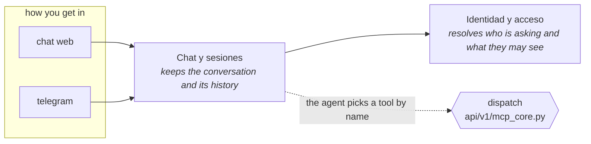

# Drawing a system for somebody who will not check it

The person reading this diagram is not going to open the code. That is not a detail about the
audience — it is the whole design constraint. **For them, an edge you invented is worse than no
diagram at all**: it looks authoritative, it is the only artifact they will ever look at, and
they have no way to notice. A wrong arrow becomes what the team believes.

So the drawing is not yours to compose. It is computed, and you label it.

```bash
mcview/mcview.py --blueprint --json          # or the MCP tool `mcview_blueprint`
```

That returns `nodes`, `edges`, `doors` and `cuts`, already correct, plus `caveats`. Every node
arrives with `responsibility: null` — **that field is your entire job**, and it is the only part
no measurement can supply.

## The four rules, and they are in the output too

They travel in the payload (`for_whoever_draws_it`) so they cannot be forgotten between the
call and the drawing. Repeated here because they are what makes the artifact safe:

1. **Do not add a node or an edge.** Every id you draw must appear in the blueprint.
2. **`unambiguous: 0` is not a connection.** Draw it dashed, or leave it out. Measured on a real
   repo: two modules with 208 references between them, all 208 the word `get` — every dictionary
   `.get()` in the file. A solid arrow there is a lie with a number behind it.
3. **Draw cuts as cuts.** Past a `dispatch` the target is chosen BY NAME and no edge crosses it.
   An arrow across invents a call that does not happen. Draw a dashed boundary and label it
   "the agent chooses here", or whatever the cut actually is.
4. **If you cannot name a node, say so.** `— unnamed` is honest. A guessed responsibility is the
   exact failure this whole flow exists to prevent.

## Naming a node

You have `id`, `files`, `symbols`, `mass_pct`, `levels` and `area`. That is enough to know
where it is, **not what it is for**. Read a few of its files first — `mcview_orient <id>` gives
you the entry points and one concrete path, and a code index gives you the source faster than
anything else. Then write ONE line: what it is responsible for, in the language of the domain,
not of the code. "Resolves who the user is and what they may see" beats "auth middleware".

## What to emit

**Mermaid, as text.** It renders natively in GitHub and in most viewers, it can be diffed, and
it can be corrected by hand. Not an image: an image cannot be diffed and goes stale without
saying so.



Two things about that shape: the doors are a subgraph because "where do I come in" is the first
question a non-reader asks, and the cut is a different node shape on purpose — it must not look
like just another step.

## Before you hand it over

Check your own drawing against the blueprint: every node id and every edge pair you drew has to
be in it. This is mechanical and it takes seconds, and it is the difference between a diagram
that was verified and one that was merely produced carefully.

```python
import json, re
b = json.load(open("blueprint.json"))
ids   = {n["id"] for n in b["nodes"]}
edges = {(e["from"], e["to"]): e for e in b["edges"]}
label = {"N1": "Chat y sesiones", "N2": "Identidad y acceso"}   # your node ids → blueprint ids

for a, z in re.findall(r"^\s*(N\d)\s*-->\s*(N\d)", open("diagram.mmd").read(), re.M):
    e = edges.get((label[a], label[z]))
    assert e, f"{label[a]} → {label[z]} is not in the blueprint"
    assert e["unambiguous"] >= 10, f"solid arrow with unambiguous={e['unambiguous']}"
assert set(label.values()) <= ids
```

Adjust the pattern to whatever you emitted; the point is that the check exists and runs, not
its exact shape. Run it on a real diagram and it catches the two mistakes that matter: an arrow
nobody computed, and a solid arrow over a homonym.

Then say, in one line under the diagram, **what it does not claim**: that this is the written
structure and not what executes, and that mass is centrality rather than importance. The
blueprint hands you those sentences in `caveats` — use them verbatim rather than paraphrasing,
because a paraphrased caveat tends to become a weaker one.

## When the grouping is `directory`

If the blueprint says `grouping: "directory"`, the project has no `[modules]` declared and the
nodes are FOLDERS. Say that on the diagram. Labelling a folder with a responsibility is how a
picture of the file tree gets mistaken for a picture of the system — and the fix is not a better
label, it is declaring the lines of work in the `.toml` first (see `mcview-install`).
